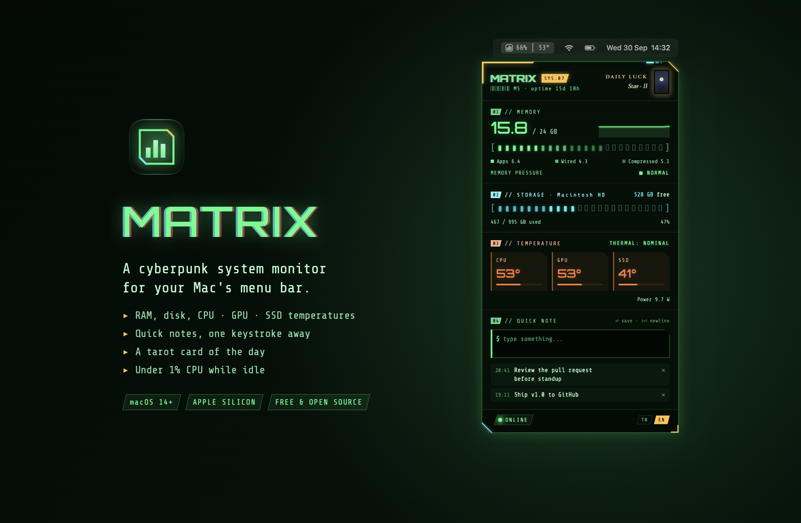
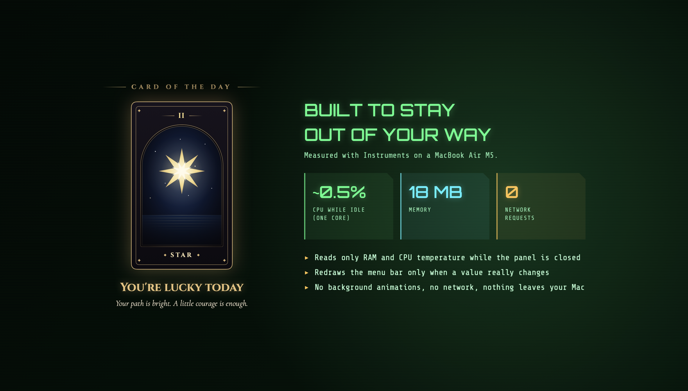

<p align="center">
  
</p>

<p align="center">
  <a href="https://github.com/4os/Matrix/releases/latest"></a>
  
  
  
  <a href="LICENSE"></a>
</p>

**Matrix** is a small system monitor that lives in your Mac's menu bar. The menu bar shows your RAM usage and CPU temperature at a glance (`62% │ 58°`). Click it to open a neon, terminal-style panel with the full picture. It's free, open source and built to use almost no resources.

## Features

- **Memory:** used / total with a 45-second history graph, the App / Wired / Compressed breakdown and the memory pressure level. These are the same numbers Activity Monitor shows.
- **Storage:** used and free space on your startup disk.
- **Temperatures:** CPU, GPU and SSD, plus the system thermal state, total power draw, and fan speed on Macs that have a fan.
- **Quick notes:** jot something down without opening an app. <kbd>Return</kbd> saves, <kbd>Shift</kbd>+<kbd>Return</kbd> adds a new line. Notes stay until you delete them.
- **Card of the day:** draw one tarot card a day for a small ritual. It flips open full-screen with a short reading, and a new card is waiting at midnight.
- **English and Turkish:** Matrix follows your system language, and the **TR / EN** switch at the bottom of the panel overrides it.
- **Starts with your Mac:** Matrix adds itself to your login items the first time it runs from Applications.

## Download and install

1. Download **[Matrix.zip](https://github.com/4os/Matrix/releases/latest/download/Matrix.zip)** from the [latest release](https://github.com/4os/Matrix/releases/latest).
2. Double-click the zip to unpack it, then drag **Matrix.app** into your **Applications** folder.
3. Open Matrix. It's a free project that isn't notarized by Apple, so macOS asks you to confirm the first launch:
   - **macOS 15 or later:** when you see *"Apple could not verify Matrix…"*, click **Done**. Open **System Settings → Privacy & Security**, scroll down to *"Matrix was blocked…"*, click **Open Anyway** and confirm.
   - **macOS 14:** right-click Matrix.app in Applications, choose **Open**, then **Open** again.

   You only need to do this once. If you prefer the Terminal, this does the same:
   ```sh
   xattr -dr com.apple.quarantine /Applications/Matrix.app
   ```
4. The Matrix icon appears in the menu bar. Click it to open the panel.

**Requirements:** a Mac with Apple Silicon (M1 or later) running macOS 14 Sonoma or later.

### Using it

| Action | What happens |
|---|---|
| Click the menu bar item | Opens or closes the panel |
| Click outside the panel or press <kbd>Esc</kbd> | Closes the panel |
| Right-click the menu bar item | *Launch at Login* on or off, and *Quit Matrix* |
| Click **DAILY LUCK** in the panel | Draws today's card, or shows it again |
| **TR / EN** at the bottom of the panel | Switches the language instantly |

### Uninstall

Right-click the menu bar item, choose **Quit Matrix**, then move **Matrix.app** to the Trash. To also remove your notes and settings:

```sh
rm -rf ~/Library/Application\ Support/Matrix
defaults delete com.ahmetonurs.Matrix
```

## Built to stay out of your way

<p align="center">
  
</p>

A menu bar monitor that slows your Mac down defeats its own purpose, so Matrix was profiled with Instruments (Time Profiler) and tuned until it all but disappears. Measured on a MacBook Air M5 with the Release build:

| State | CPU | Memory |
|---|---|---|
| Panel closed (almost all the time) | about 0.3–0.6% of one core | ~18 MB |
| Panel open | about 0.8–1.1% of one core | ~34 MB |

How it stays this light:

- **Reads only what's on screen.** With the panel closed, Matrix reads just the RAM figures and the CPU temperature for the menu bar. GPU, SSD, power and disk are read only while the panel is open.
- **Redraws the menu bar only when a number really changes.** Values move only once a reading is a full point away, so sensor jitter doesn't redraw your menu bar every second. It also keeps the reading steady.
- **Releases the panel when it closes.** Nothing is laid out or drawn in the background.
- **No animations tied to live data.** Animating the gauges would redraw the whole panel at 60 fps several times a minute, so values update in place.
- **Plays well with power management.** The 1.5-second sampling timer has a tolerance, so macOS can group its wake-ups with other work.

## How it works

Matrix is written in Swift 6 with SwiftUI and AppKit, and reads everything locally through macOS APIs:

| Data | Source |
|---|---|
| Memory | `host_statistics64(HOST_VM_INFO64)` and the kernel's `kern.memorystatus_vm_pressure_level` |
| Storage | `volumeAvailableCapacityForImportantUsage` on the startup volume |
| Temperatures, power, fan | Read-only access to the Apple SMC: `Tp*`/`Te*` (CPU cores), `Tg*` (GPU), `TH0x` (SSD), `PSTR` (system power), `F0Ac` (fan) |
| Thermal state | `ProcessInfo.thermalState` |

Reading the SMC needs neither administrator rights nor any special permission, but the Mac App Store sandbox doesn't allow it. That's why Matrix is distributed here instead of on the App Store.

### Privacy

Matrix makes **no network requests** and collects nothing. Notes are stored only on your Mac, in `~/Library/Application Support/Matrix/notes.json`.

## Build from source

You need Xcode 16 or later and [XcodeGen](https://github.com/yonaskolb/XcodeGen).

```sh
git clone https://github.com/4os/Matrix.git
cd Matrix
scripts/install.sh      # builds a Release copy and installs it to /Applications
```

To work on it in Xcode, run `xcodegen generate` and open `Matrix.xcodeproj`. The project is generated from `project.yml`, so edit that file rather than the Xcode project. Tests run with <kbd>⌘U</kbd>.

- `swift scripts/make-icon.swift` regenerates the app icon.
- Debug builds have two helper modes: `--snapshot <dir>` renders the panel and every card to PNG files, and `--readme-art <dir>` renders the images in this README.
- To profile the Release build, build it with `OTHER_SWIFT_FLAGS='$(inherited) -D PROFILE'` and launch it with `--show-panel`. The panel then opens at launch without a click.

## Credits

- Fonts: [Share Tech Mono](https://fonts.google.com/specimen/Share+Tech+Mono), [Orbitron](https://fonts.google.com/specimen/Orbitron), [Cinzel](https://fonts.google.com/specimen/Cinzel) and [Cormorant Garamond](https://fonts.google.com/specimen/Cormorant+Garamond). All are under the SIL Open Font License, and their license files are in `Sources/Resources/Fonts`.
- All card art is drawn in code. If you'd like the Angel card to use your own illustration, put it at `LocalAssets/tarot-art.jpg` (git-ignored) and it's bundled when you build.

## License

[MIT](LICENSE) © 2026 Ahmet Onur
